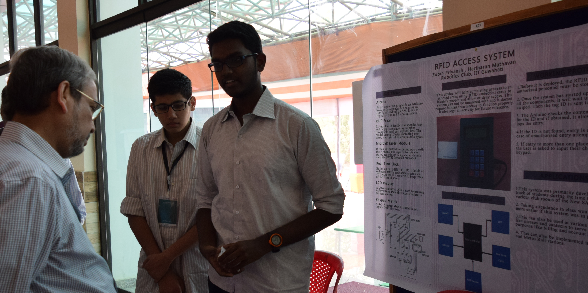

History
=======

The idea of RFID based automation in IITG is quite old. The first was probably Shashank Agarwal's project,  submitted it in Electrovate event of Kriti 2014. 

His idea was to use RFID based cards for automated accounting of mess extra items. Thus, we would no longer lose 2-3 rupees every day due to not having exact change. The system would keep the credits, and we can pay it at one go at the end of the month. 

Around the same time, the Institute moved from simple plastic ID cards to RFID based ID cards. 

The Robotics Club continued to work on RFID based systems. Zubin Priyansh and Hariharan Mathavan worked on the New SAC Entry Register automation over the next year(2014-2015). They worked with a mindset to build a prototype and implement it in New SAC, but couldn't achieve that goal. 

	Zubin and Hariharan demonstrating their work to Prof. Gautam Biswas, Director, IIT Guwahati. The photo was taken during Techevince 2.0, in the year 2015. 

Over the next couple of years, several people worked on using RFID cards for various automation. It was also a hot topic in the next two editions of Electrovate. 

1. `Library Access System <https://www.youtube.com/watch?v=rExfvu2eE5w>`_
2. `Happy Wash <https://www.youtube.com/watch?v=GcaPpA-8Swo>`_
3. `Mess Automation using RFID <https://www.youtube.com/watch?v=Ukd1JLJeXcM>`_
4. `Sports Complex Automation <https://www.youtube.com/watch?v=4nozcCsH7Ik>`_

